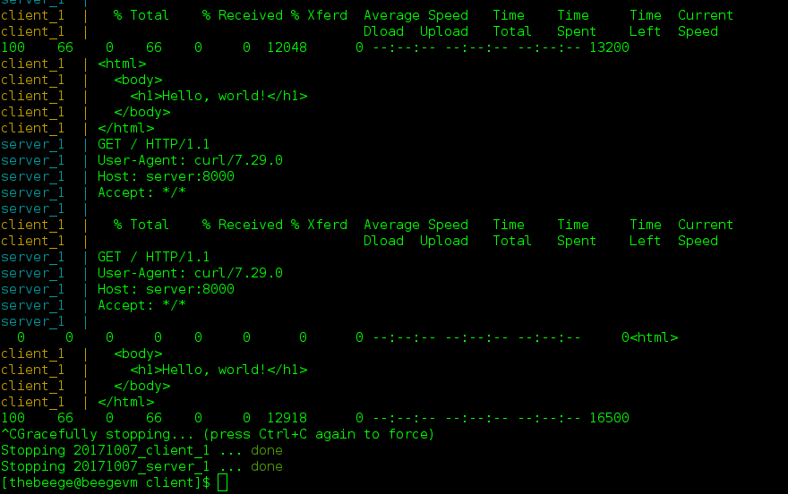

**Disclaimer**: I am not an expert. I'm quite the opposite. I usually learn just enough to accomplish what I need, and I move on. Do not take what I write here as best practice! This is only intended to expose the potential of technologies. I always recommend reading the official documentation or tutorials, and ideally, translating them if necessary :D


Today, I'd like to tell you about Docker, but first, a word about a preceding alternative. Most people are familiar with virtual machines: you setup an OS the way you want, create an image of it, use some hypervisor to host virtual machines, and deploy your images at will. For many years, this has been an effective method to diversify the usage of physical compute resources. However, virtualization has its downsides. Entire operating systems have a pretty large amount of overhead in terms of resource usage. Boot times can be painful. Virtual disk images are large, making it a pain to move things around, and they're a pain to create. (This has been mitigated by Vagrant, but that's also a recent development.) This works, and it has worked for many years. However, are there alternatives?

Enter Docker. Docker uses what are called "containers" instead of virtual machines. These utilize Linux cgroups (or Hyper-V on Windows) to create an isolated but low-overhead operating environment. Containers have noticeably less overhead than virtual machines, and startup is wicked fast. Docker specifically provides a wealth of tools to make working with containers easy and even pleasant. Similar to Vagrant, you can define a text file called a Dockerfile that defines how the container is configured. There's a collection of CLI tools for building Docker images from Dockerfiles, pushing and pulling images from Dockerhub or Docker registry (git -> Github : Docker -> Dockerhub), and managing containers. There are also a wealth of tools to orchestrate Docker containers. We'll cover what orchestration is and means later in this post.

Sounds great! How do we get started? Well, it depends on your machine.

Running Windows? You'll need Windows Professional or higher, since it depends on Hyper-V. I'm running Windows Home, so I had to setup a CentOS virtual machine to run Docker in. Check out Docker for Windows here: https://docs.docker.com/docker-for-windows/install/

Running on Mac? You've got it easy. Check out Docker for Mac here: https://docs.docker.com/docker-for-mac/install/

Running on Linux? Here's a link for CentOS: https://docs.docker.com/engine/installation/linux/docker-ce/centos/
There a links for other distributions in the navigation pane on the left.

Double-check to make sure that the `docker` service is started!

Now that you have things installed, let's build something. Let's build a self-contained environment with an HTTP server in one container, a client in another container, and configurations for running all of it.

Let's get started. First, we're going to build a _super_ simple HTTP server. Create a new folder (I called mine `server`), and create these two files in it.

server.bash:
```
#!/bin/bash

while true
do
  ncat -l $(hostname -I) 8000 < hello.http
done
```

hello.http:
```
HTTP/1.0 200 OK

<html>
  <body>
    <h1>Hello, world!</h1>
  </body>
</html>
```

Sloppy, I know, but it works. This script uses nmap's `ncat` command to serve up some text written out following HTTP to simulate a web server. Since `ncat` stops listening after fulfilling a request, we just loop it forever. If you weren't sure, _don't use ncat for a legitimate HTTP server_. This is just a tech demo for another tool, so I think The Right Way™ gods will forgive me.

If you have a bash shell available, this will run an HTTP server on port 8000. While its running, you can visit `localhost:8000` and see a tiny page with "Hello, world!". This will work for our example.

Now, let's containerize it. Create a new file called Dockerfile also in this folder. No extension! It should look like this:

```
FROM centos

RUN yum install -y nmap-ncat

ADD ./ ./

EXPOSE 8000

CMD ./server.bash
```

This is Dockerfile syntax. You can see the full docs here: https://docs.docker.com/engine/reference/builder/
A Dockerfile defines a Docker image. This can be compared to a virtual machine image. Again, a Dockerfile is much like a Vagrantfile if you're familiar with Vagrant.
`FROM` indicates that we're going to inherit from another Dockerfile. Yes, Docker supports inheritance. It's lovely. Basically, this image will start from the mentioned image, and we'll build on top of it. Where does this other Dockerfile/image come from? Docker Hub! https://hub.docker.com/ In this case, we're going to base our image on CentOS.
`RUN` is simply a way to run a command to help setup the image. In this case, we're installing `ncat` since we'll need it for the demo.
`ADD` is how you get files from your filesystem into the image. Here, we're just copying everything in our directory to the image's working directory. I'm lazy.
`EXPOSE` tells the container which ports will need network access. This is important if you're expected inbound network requests.
`CMD` is the command that will run when the container is started.
Viola! We have our first Dockerfile setup. Let's run it:
```
docker build -t demo_http_server .
```
This will search the current directory for a `Dockerfile`, create an image from it, and tag it as `demo_http_server`:


Now, we can run the container:
```
docker run -d -p 8000:8000 demo_http_server
```


The `-d` flag tells Docker to detach from the container, meaning it will run in the background. The `-p 8000:8000` tells docker to bind the container's port 8000 to the host's port 8000, meaning our server will be accessible via the host machine at port 8000. Lastly, we tell it the image ID or tag or the image we want to create a container from. Now, you can hit your web server from the browser.


Congratulations! You have your first docker container running!

Fancy, huh? Let's get more fancy.

Make a separate folder called client, and drop this bash script in there:
```
#!/bin/bash
# This script should take in 2 arguments: the host to curl and its port

url=$1
port=$2

while true
do
  curl $url:$port
  sleep 1
done
```

Now, create a Dockerfile in that folder:
```
FROM centos

ADD client.bash client.bash

ARG server
ARG port=8000

ENV server $server
ENV port $port

CMD ./client.bash $server $port
```

You'll notice this file is slightly different.
`ARG` allows our container to take arguments, meaning we can configure some things at image build time.
`ENV` sets environment variables within the container.
In this case, we're taking arguments to the container, making them available to the shell environment, then passing them as inputs to our bash script. This script just makes an HTTP request to the given server at the given port repeatedly with a 1-second delay. Let's see them work together.

Now, there is a way to get these two containers talking to each other running manually, but that's dumb. It's a lot of effort. There's an easier way.

Instead, we can create a docker-compose file, which sets up multiple containers. I have this in a `docker-compose.yml` file in the folder above my `server` and `client` folders.

```
version: '3'

services:

  server:
    build:
      context: ./server
    ports:
      - "8000:8000"

  client:
    build:
      context: ./client
      args:
        server: 'server'
        port: 8000
    links:
      - "server"
```

This file will allow us to use the `docker-compose` command to build and run multiple containers that are networked together to talk to each other.
`version` refers to the version of docker-compose we're using.
`services` is where we define each of the services we'll run in containers.
`args` corresponds to the arguments we defined in our Dockerfile.
`links` establishes links between services, where the linked service has a hostname entry with the name of the service. So from the client, we can reference the server container as `server` since we defined the link and service as `server`.
The rest you can kind of figure out. If not, ask in a comment!

From here, we can simply run the below:
```
docker-compose up
```
You'll see the server and client both startup, and you'll see the client request from the server every second infinitely. To stop them, just ctrl + c.


We could do more! There are prebuilt images for all sorts of things, like databases, message queues, and web servers. You can setup an entire application stack for your local development environment. I did this at work (and impressed my coworkers).

In production, you could use Docker Swarm, Kubernetes, or Mesos to orchestrate and manage containers for your various services. Easy, observable, fault tolerant.

For now, this blog entry is long enough. :) Thank you for your time! I hope you found the material helpful. Please comment with any questions, comments, or suggestions. Also let me know if you have any requests for technologies you'd like me to cover!

Huge thanks to Jiyoung with Django Girls Seoul for translating! You should definitely check them out if Python and/or Django are in your future. I also recommend my own meetup, Learn Teach Code Seoul. If you think this blog was good work, it's a testament to how well our two groups collaborate together, so you should check out both!

I welcome feedback! Don't worry, I won't be offended. I see feedback as a gift for helping me improve. I'm greedy. Give me gifts!
