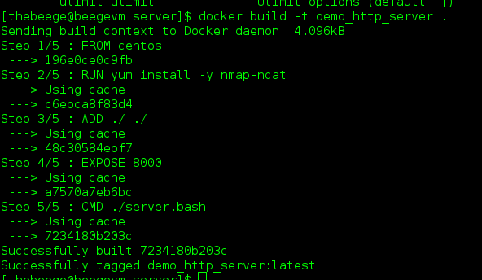
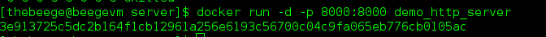
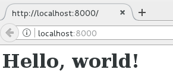
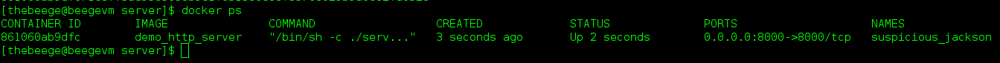
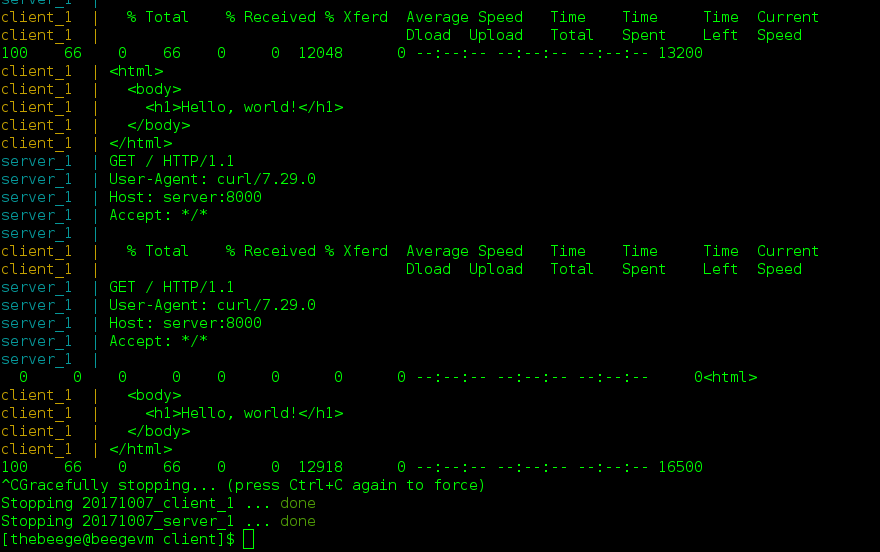

# 도커로 인프라 자동화하기

이것은 2023-04-22에 업데이트 되었습니다.

**읽어주세요**: 저는 전문가가 아닙니다. 사실 그 반대라고 할 수 있죠. 보통 제가 필요한 걸 할 수 있을 정도로만 배우고 넘어갑니다. 여기에 쓴 내용이 모범 사례라고 생각하지 말아주세요! 그저 기술로 할 수 있는 일들을 드러내기 위해서 썼을 뿐입니다. 저는 항상 공식문서나 튜토리얼을 읽어볼 것을 추천하는데요. 이상적으로는 필요하다면 번역을 해보는 것이 좋습니다.

오늘은 도커를 다뤄볼 건데요. 연습용 서비스를 만들어보고, 도커를 이용해 컨테이너 기반의 소스 제어 인프라에서 서비스 실행을 자동화 할겁니다. 이게 무슨 뜻일까요?

먼저, 이전에 쓰던 방식을 이야기해보겠습니다. 많은 분들이 가상 머신은 익숙하실 겁니다. 원하는대로 OS를 설정하고, 이미지를 만들고, 가상 머신을 호스트하는 하이퍼 바이저를 사용하고, 마음껏 이미지를 배포하는 것이죠. 수년동안 이 방법은 물리적 컴퓨팅 리소스를 다양하게 사용하는 효과적인 방법이었습니다. 하지만 가상화에도 단점이 있습니다. 전체 운영 체제에 리소스 사용량 측면에서 상당한 오버헤드가 있는데요. 부팅하는 시간이 고통스러울 수 있습니다. 가상 디스크 이미지는 크기가 커서 이를 옮기기에도 고통스럽고 만들기도 어렵습니다.(Vagrant를 통해서 완화되긴 했지만 이것도 최근에 개발되었습니다.) 이 방법은 수년동안 효과가 있었습니다. 그렇지만 대안은 없는 걸까요?

도커에 입문해봅시다. 도커는 가상머신 대신에 '컨테이너'라는 것을 사용합니다. 이들은 'Linux cgroups'(Mac 및 Windows의 가상 시스템 내부)를 사용해 분리되어 있지만 오버헤드가 적은 운영 환경을 생성합니다.  컨테이너는 가상머신보다 오버헤드가 현저히 적고, 부팅도 무지 빠릅니다. 도커는 특히 컨테이너 작업을 더 쉽고 즐겁게 할 수 있는 풍부한 도구를 제공합니다. Vagrant와 마찬가지로 컨테이너 구성 방법을 정의하는 Dockerfile이라는 텍스트 파일을 정의할 수 있습니다. Dockerfile들을 읽고 도커 이미지를 만들거나, Dockerhub 또는 Docker registry (git -> Github : Docker -> Dockerhub)에서 이미지를 내려받거나 올리고, 컨테이너를 관리하는 CLI 도구들도 있습니다. 그밖에 도커 컨테이너들을 조정(orchestrate)하는 툴들도 많습니다. '조정(Orchestration)'이 무엇인지는 이 포스팅의 후반부에서 다루겠습니다.

좋습니다! 그럼 어떻게 시작하면 좋을까요? 여러분이 갖고있는 머신에 따라 다릅니다.

Windows를 실행하시나요? 먼저 Linux용 Windows 하위 시스템을 설치해야 한다는 점에 유의하세요 : https://learn.microsoft.com/en-us/windows/wsl/install. 

설치가 완료되면 여기에서 ' Windows '용 ' Docker '를 확인하세요 : https://docs.docker.com/desktop/install/windows-install/.

맥을 사용한다면 간단합니다. 맥을 위한 도커는 이곳을 확인하세요: https://docs.docker.com/desktop/install/mac-install/

리눅스를 사용한다면 아래 링크에 CentOS를 위한 내용이 있습니다: https://docs.docker.com/engine/install/ubuntu/
왼쪽 메뉴에 다른 배포판을 위한 링크들도 있습니다.

`도커` 서비스가 시작되었는지 다시 한번 확인해주세요!

이제 설치가 끝났으니 뭔가를 만들어봅시다. 하나의 컨테이너에 HTTP 서버, 다른 컨테이너에 클라이언트 및 모든 컨테이너를 실행하기 위한 설정을 포함하는 독립적인(self-contained) 환경을 구축해보죠.

이제 시작해봅시다. 먼저 _완전_ 간단한 HTTP 서버를 만들어보겠습니다. 새로운 폴더를 만들고 (저는 `server`라고 했습니다), 아래 2개의 파일을 만듭니다.

server.sh:
```
#!/bin/sh

trap exit EXIT INT TERM HUP

while true
do
	# `-k`를 사용하는건 어떤가요? `hello.http`는 단 한번만 사용하면 됩니다.
  # 또한 `wait`가 함정을 잡을 수 있도록 후방으로 보내기도 합니다.
  ncat -l $(hostname -I) 8000 < hello.http &
	wait
done
```

hello.http:
```
HTTP/1.0 200 OK

<html>
  <body>
    <h1>Hello, world!</h1>
  </body>
</html>
```

조잡하긴 하지만 잘 실행됩니다. 이 스크립트는 nmap의 `ncat` 명령을 사용해서 웹서버를 시뮬레이션하기 위해 HTTP 다음에 작성된 텍스트를 실행합니다. `ncat` 은 요청을 실행하고 나서는 요청 받는 것을 멈추기 때문에 이것을 영원히 반복하게 됩니다. 확실하지 않다면, _실제 HTTP 서버를 위해서는 ncat을 사용하지 마세요_. 이것은 다른 툴을 보여주기 위한 하나의 기술 데모일 뿐입니다. 그러니, '올바른 방법의 신'은 나를 용서해주겠죠.

POSIX 셸을 사용할 수 있다면, 8000 포트에서 HTTP 서버를 실행할 것입니다. 실행이 되는 동안 `localhost:8000`에 접속해서 "Hello, world!"가 적혀있는 간단한 페이지를 확인할 수 있습니다. 우리 예제에서는 이정도면 됩니다.

이제 컨테이너화해봅시다. 같은 폴더에 Dockerfile 이라는 새로운 파일을 만들어주세요. 확장자명은 없습니다! 아래와 같이 보여야 합니다.

```
FROM alpine

RUN apk add --no-cache nmap-ncat

ADD ./ ./

EXPOSE 8000

CMD ["./server.sh"]
```

이것은 Dockerfile 의 신택스입니다. 전체 문서는 여기서 확인하세요: https://docs.docker.com/engine/reference/builder/

Dockerfile은 도커 이미지를 정의합니다. 이것은 가상 머신의 이미지와도 비슷합니다. 다시 한번 말씀드리지만, 여러분이 Vagrant에 익숙하다면 Dockerfile은 Vagrant와 매우 비슷합니다.

`FROM`은 다른 도커파일에서 상속받을 것이라는 것을 나타냅니다. 네, 도커는 상속을 지원합니다. 좋죠. 기본적으로 이미지는 위에서 언급한 이미지에서 시작해서, 우리는 그 위에다 빌드하게 됩니다. 이 다른 Dockerfile/이미지는 어디에서 오는 것일까요? 바로 Docker Hub입니다! https://hub.docker.com/ 이 경우에는 CentOS에 이미지를 저장하겠습니다.

`RUN`은 이미지 설치를 도와주는 명령어입니다. 이 경우, 우리는 데모에 필요한 `ncat`을 설치합니다.

`ADD`는 파일 시스템에서 파일을 이미지로 받아오는 방법입니다. 여기서 그냥 디렉토리의 모든 것을 복사해서 이미지의 작업 디렉토리에 붙여넣겠습니다. 저는 게으르니까요.

`EXPOSE`는 컨테이너에 네트워크 접근이 필요한 포트를 알려줍니다. 인바운드 네트워크 요청이 예상되는 경우 이것이 중요합니다.

`CMD`는 컨테이너가 시작될 때 실행될 명령입니다.
우와! 첫 번째 Dockerfile 설정을 완료했습니다. 이제 실행해봅시다:

```
docker build -t demo_http_server .
```

그러면 현재 디렉토리에서 `Dockerfile`이 있는지 검색해서, 이미지를 만들고, `demo_http_server`라는 태그를 지정하게 됩니다:



이제 컨테이너를 실행할 수 있습니다:
```
docker run -d -p 8000:8000 demo_http_server
```



`-d` 플래그는 Docker가 컨테이너에서 분리되도록 지시하는데, 이는 백그라운드에서 실행되는 것을 의미합니다. `-p 8000 : 8000`은 docker에 컨테이너의 8000 포트를 호스트의 8000 포트에 바인드하도록 지시합니다. 즉, 우리 서버는 호스트 머신을 통해 8000 포트에 접근할 수 있습니다. 마지막으로 도커에게 어떤 이미지 ID 또는 태그 또는 이미지를 컨테이너로 만들고 싶은지 알려줍니다. 이제 브라우저에서 웹 서버에 접근할 수 있습니다.



축하합니다! 여러분의 첫 번째 도커 컨테이너가 작동 중입니다!

하지만 정리를 좀 해봅시다. 현재 실행중인 컨테이너를 봅시다.
```
docker ps
```


이제 컨테이너, 해당 ID, 기반 이미지, 현재 실행중인 명령, 이름 및 기타 정보를 볼 수 있습니다. 컨테이너의 이름을 지정하지 않으면 Docker가 이름을 생성해줍니다.

이제 이 컨테이너를 더 이상 사용하지 않을 것이기 때문에 컨테이너를 중지합시다. 제 컨테이너의 이름이 `suspicious_jackson`이므로, 아래처럼 간단하게 중지할 수 있습니다.

```
docker stop suspicious_jackson
```

컨테이너의 ID를 사용할 수도 있습니다. 나중에 `docker ps`를 다시 실행하면 실행중인 컨테이너가 없다는 것을 볼 수 있습니다.

멋지죠? 더 멋진 것을 해봅시다.

다른 폴더에 client라는 이름으로 파일을 만들고 아래의 셸 스크립트를 적어주세요.

```
#!/bin/sh
# This script should take in 2 arguments: the host to curl and its port

url=$1
port=$2

trap exit EXIT INT TERM HUP

while true
do
  curl -s $url:$port
  sleep 2
done
```

이제 그 폴더에 Dockerfile을 만들어주세요:

```
FROM alpine

RUN apk add --no-cache curl

ADD client.sh client.sh

ARG server
ARG port=8000

ENV server $server
ENV port $port

CMD ["sh", "-c", "./client.sh $server $port"]
```

이 파일이 아까와는 약간 다르다는 것을 눈치채실 겁니다.

`ARG`는 컨테이너가 인자를 받을 수 있게 해줍니다. 이는 이미지를 빌드할 때 몇 가지 사항을 설정할 수 있음을 의미합니다.

`ENV`는 컨테이너 내의 환경 변수를 설정합니다.

이 경우 우리는 컨테이너에 인자를 받아서 쉘 환경에서 사용할 수 있게 만든 다음, 셸 스크립트에 입력값으로 전달합니다. 이 스크립트는 지정된 포트에서 지정된 서버에 2초 간격으로 반복되는 HTTP 요청을 만듭니다. 이 모두가 어떻게 작동하는지 봅시다.

이제, 이 두개의 컨테이너가 서로 수동으로 통신하는 방법이 있지만, 그것은 많은 노력이 필요합니다. 더 쉬운 방법이 있습니다.

대신 여러 개의 컨테이너를 설정하는 도커 작성 파일을 만들 수 있습니다. 저는 `server`와 `client`의 폴더 위에 있는 폴더에 `docker-compose.yml`에 설정해두었습니다.

```
version: '3'

services:

  server:
    build:
      context: ./server
    ports:
      - "8000:8000"

  client:
    build:
      context: ./client
      args:
        server: 'server'
        port: 8000
    links:
      - "server"
```

이 파일은 `docker-compose` 명령을 사용할 수 있게 해주는데, 서로 네트워크로 연결된 여러 컨테이너를 만들고 실행할 수 있는 스크립트입니다.

`version`은 우리가 사용하고있는 docker-compose의 작성 버전을 나타냅니다.

`services`는 우리가 컨테이너에서 실행할 각각의 서비스를 정의하는 곳입니다.

`args`는 Dockerfile에서 정의한 인수에 해당합니다.

`links`는 서비스 간 링크를 생성합니다. 링크된 서비스는 서비스 이름과 같은 hostname 엔트리를 갖습니다. 우리는 링크와 서비스를 `server`로 정의했으므로 클라이언트에서 서버 컨테이너를 `server`로 참조할 수 있습니다.

나머지 부분을 다루지 않겠지만, 명확하지 않은 부분은 댓글을 달아주세요! 어떤 질문이든 상관없습니다.

여기에서 우리는 아래의 명령어를 간단하게 실행할 수 있습니다:
```
docker-compose up
```
서버와 클라이언트가 모두 시작되는 것을 볼 수 있습니다. 매 초마다 서버가 클라이언트에 보내는 요청을 무한히 보게 될 것입니다. 이를 중지하려면 그냥 Ctrl + C를 누르면됩니다.



더 많은 것을 할 수도 있습니다! 데이터베이스, 메시지 큐, 웹 서버와 같은 모든 종류의 것에 대해 미리 작성된 이미지가 있습니다. 로컬 개발 환경에 맞게 전체 응용 프로그램 스택을 설정할 수도 있습니다. 저는 직장에서 이것을 했습니다 (그리고 동료들을 감동시켰죠).

프로덕션 환경에서는 Docker Swarm, Kubernetes 또는 Mesos를 사용하여 다양한 서비스를 위한 컨테이너를 조율하고 관리할 수 ​​있습니다. 쉽고, 관찰할 수 있고, 오류를 견딥니다(fault tolerant).

우리는 오늘 많은 것을 했습니다!
* 도커 설치
* Dockerfile 만들기
* 도커 이미지 만들기
* 도커 컨테이너 실행
* `docker-compose`를 이용한 서비스 정의
* 한 네트워크에서 여러 서비스 실행

잘했어요!

첫 글 치고는 길었네요 :) 시간 내 주셔서 감사합니다! 자료가 도움이 되었기를 바랍니다. 질문, 의견, 제안이 있다면 댓글을 달아주세요. 그리고 제가 다루었으면 하는 기술이 있다면 알려주세요!

번역을 도와준 Django Girls Seoul의 [지영에게](https://jyhwng.github.io/) 감사를 드립니다! Python이나 Django에 관심이 있다면 꼭 한번 그들을 만나보세요. 제가 운영하는 Learn Teach Code Seoul의 밋업도 추천합니다. 이 블로그가 좋다고 생각한다면, 우리 두 그룹이 얼마나 잘 콜라보하는지 보여주는 것이죠. 그러니 두 그룹 모두 한번 확인해보세요!

피드백은 환영합니다! 걱정하지 마세요. 저는 상처받지 않습니다. 피드백은 개선을 위한 선물이라고 생각합니다. 저는 욕심이 많아요. 선물을 주세요!

전체 소스가 필요하다면 여기서 보실 수 있습니다. https://github.com/TheBeege/blog-docker
